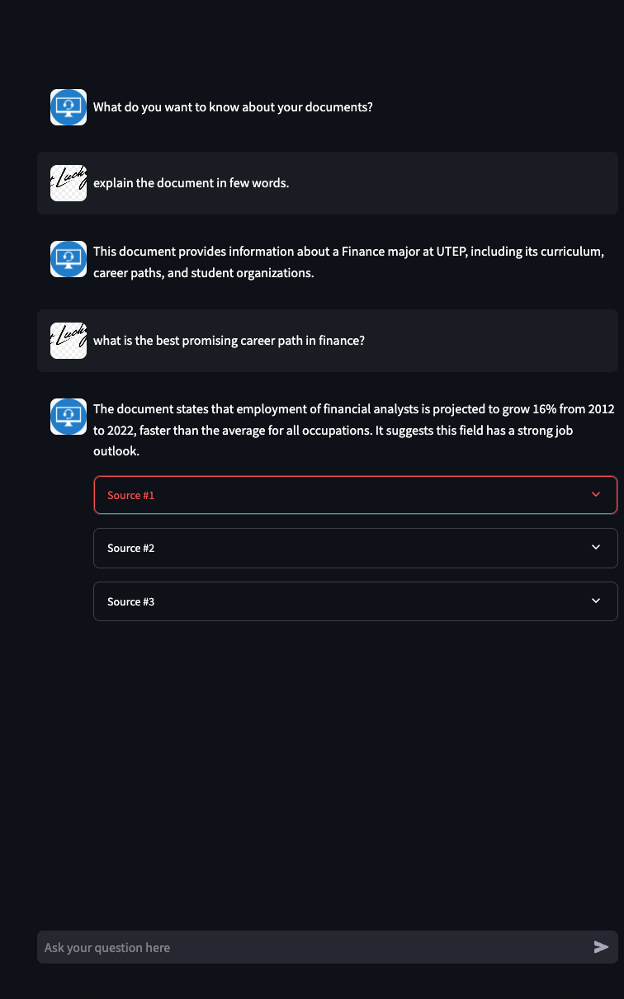

## Retrieval Augmented Generation Pipeline

### Tools and Libraries Used
- langchain
    - core
    - experimental
    - community
    - pyPDFium2
    - groq
    - ollama
    - qdrant
    - vectorstore
    - FastembedEmbedding
    - FlashrankRerank
- qdrant-client
- streamlit
- pydantic

### RAG Chat Interface

